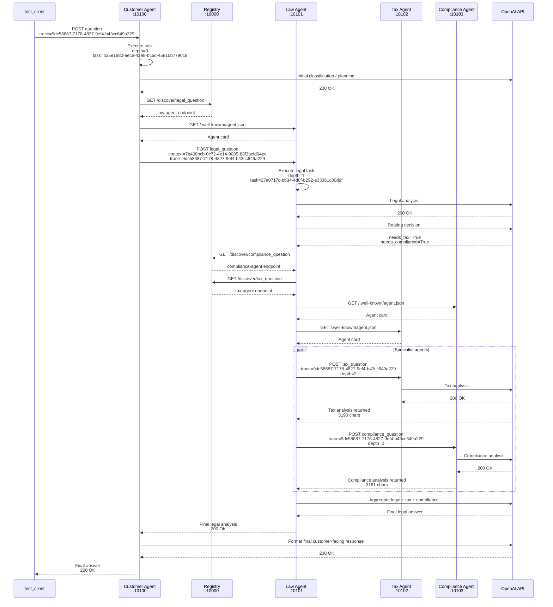

# Trace Request Flow - Stage 5 Distributed A2A System

## 1. Mục tiêu

Bài này thực hiện trace request flow trong hệ thống multi-agent distributed sử dụng A2A protocol. Mục tiêu là tìm `trace_id` trong logs, theo dõi request đi qua các agents, sau đó vẽ sequence diagram mô tả luồng xử lý.

---

## 2. Thông tin trace tìm được trong logs

### Trace ID

```text
trace=9dc58687-7178-4827-9ef4-b43cc649a229
```

### Context ID

```text
context=7b408bcb-0c72-4e14-9085-88f3bcfd04ee
```

### Task ID theo từng agent

| Agent | Task ID | Depth |
|---|---|---|
| Customer Agent | `b25e1680-aece-42e8-bc6d-45810b7790c8` | 0 |
| Law Agent | `27a0717c-bb34-4d0f-b292-e33361c80d9f` | 1 |
| Tax Agent | `6dceb3b2-bf16-4d67-9858-9a2685b2a201` | 2 |
| Compliance Agent | `459ef453-1566-4184-9ddc-d72d31d52f25` | 2 |

Nhận xét: Tất cả agents đều dùng chung `trace_id` và `context_id`, chứng minh request được truyền xuyên suốt qua nhiều service khác nhau. Mỗi agent có `task_id` riêng để đại diện cho công việc xử lý của agent đó.

---

## 3. Agents đã đăng ký với Registry

Từ Registry logs, các agents đã đăng ký thành công:

| Thời gian | Agent | Endpoint | Task hỗ trợ |
|---|---|---|---|
| 16:10:04 | law-agent | `http://localhost:10101` | `legal_question` |
| 16:10:15 | tax-agent | `http://localhost:10102` | `tax_question` |
| 16:10:27 | compliance-agent | `http://localhost:10103` | `compliance_question` |
| 16:10:35 | customer-agent | `http://localhost:10100` | none |

Registry đóng vai trò service discovery. Các agents không cần hardcode endpoint của nhau mà có thể query Registry theo loại task.

---

## 4. Request flow theo logs thực tế

### Bước 1: Client gửi câu hỏi tới Customer Agent

`test_client.py` kết nối tới Customer Agent tại:

```text
http://localhost:10100
```

Câu hỏi được gửi:

```text
If a company breaks a contract and avoids taxes, what are the legal and regulatory consequences?
```

Customer Agent nhận request:

```text
2026-06-09 16:12:38,263 [customer_agent] INFO CustomerAgent executing | task=b25e1680-aece-42e8-bc6d-45810b7790c8 context=7b408bcb-0c72-4e14-9085-88f3bcfd04ee trace=9dc58687-7178-4827-9ef4-b43cc649a229 depth=0
```

Ý nghĩa:

- `depth=0`: Customer Agent là agent đầu tiên trong chuỗi xử lý.
- `trace=9dc58687-7178-4827-9ef4-b43cc649a229`: trace ID chính của request.
- `context=7b408bcb-0c72-4e14-9085-88f3bcfd04ee`: context chung cho toàn bộ request.

---

### Bước 2: Customer Agent delegate request sang Law Agent

Customer Agent quyết định chuyển câu hỏi sang legal agent:

```text
2026-06-09 16:12:40,712 [customer_agent] INFO Customer delegate_to_legal_agent | trace=9dc58687-7178-4827-9ef4-b43cc649a229 context=7b408bcb-0c72-4e14-9085-88f3bcfd04ee depth=0
```

Sau đó Customer Agent gọi Registry để tìm agent xử lý `legal_question`:

```text
2026-06-09 16:12:41,128 [customer_agent] INFO HTTP Request: GET http://localhost:10000/discover/legal_question "HTTP/1.1 200 OK"
```

Registry log xác nhận:

```text
2026-06-09 16:12:41,128 [registry] INFO Discovered agent 'law-agent' for task 'legal_question'
```

Customer Agent lấy agent card của Law Agent:

```text
2026-06-09 16:12:41,536 [customer_agent] INFO HTTP Request: GET http://localhost:10101/.well-known/agent.json "HTTP/1.1 200 OK"
```

---

### Bước 3: Law Agent nhận request

Law Agent nhận request từ Customer Agent:

```text
2026-06-09 16:12:41,538 [law_agent] INFO LawAgent executing | task=27a0717c-bb34-4d0f-b292-e33361c80d9f context=7b408bcb-0c72-4e14-9085-88f3bcfd04ee trace=9dc58687-7178-4827-9ef4-b43cc649a229 depth=1
```

Ý nghĩa:

- Law Agent dùng cùng `trace_id` và `context_id` với Customer Agent.
- `depth=1` cho thấy Law Agent được gọi bởi Customer Agent.
- Law Agent có `task_id` riêng.

Law Agent gọi OpenAI API để phân tích pháp lý ban đầu:

```text
2026-06-09 16:13:00,530 [law_agent] INFO HTTP Request: POST https://api.openai.com/v1/chat/completions "HTTP/1.1 200 OK"
```

Sau đó Law Agent gọi OpenAI API tiếp để đưa ra routing decision:

```text
2026-06-09 16:13:02,348 [law_agent] INFO HTTP Request: POST https://api.openai.com/v1/chat/completions "HTTP/1.1 200 OK"
2026-06-09 16:13:02,350 [law_agent] INFO Routing decision: needs_tax=True needs_compliance=True
```

Kết luận routing:

```text
needs_tax=True
needs_compliance=True
```

Vì vậy Law Agent cần gọi thêm Tax Agent và Compliance Agent.

---

### Bước 4: Law Agent discover Compliance Agent và Tax Agent

Law Agent gọi Registry để tìm Compliance Agent:

```text
2026-06-09 16:13:02,895 [law_agent] INFO HTTP Request: GET http://localhost:10000/discover/compliance_question "HTTP/1.1 200 OK"
```

Registry log:

```text
2026-06-09 16:13:02,894 [registry] INFO Discovered agent 'compliance-agent' for task 'compliance_question'
```

Law Agent gọi Registry để tìm Tax Agent:

```text
2026-06-09 16:13:03,030 [law_agent] INFO HTTP Request: GET http://localhost:10000/discover/tax_question "HTTP/1.1 200 OK"
```

Registry log:

```text
2026-06-09 16:13:02,895 [registry] INFO Discovered agent 'tax-agent' for task 'tax_question'
```

Sau đó Law Agent lấy agent card của hai specialist agents:

```text
2026-06-09 16:13:03,306 [law_agent] INFO HTTP Request: GET http://localhost:10103/.well-known/agent.json "HTTP/1.1 200 OK"
2026-06-09 16:13:03,417 [law_agent] INFO HTTP Request: GET http://localhost:10102/.well-known/agent.json "HTTP/1.1 200 OK"
```

---

### Bước 5: Compliance Agent và Tax Agent xử lý specialist tasks

Compliance Agent nhận request:

```text
2026-06-09 16:13:03,308 [compliance_agent] INFO ComplianceAgent executing | task=459ef453-1566-4184-9ddc-d72d31d52f25 context=7b408bcb-0c72-4e14-9085-88f3bcfd04ee trace=9dc58687-7178-4827-9ef4-b43cc649a229 depth=2
```

Tax Agent nhận request:

```text
2026-06-09 16:13:03,419 [tax_agent] INFO TaxAgent executing | task=6dceb3b2-bf16-4d67-9858-9a2685b2a201 context=7b408bcb-0c72-4e14-9085-88f3bcfd04ee trace=9dc58687-7178-4827-9ef4-b43cc649a229 depth=2
```

Ý nghĩa:

- Cả Tax Agent và Compliance Agent đều có cùng `trace_id` và `context_id`.
- Cả hai đều có `depth=2`, chứng minh chúng được gọi bởi Law Agent.
- Mỗi specialist agent có `task_id` riêng.

Tax Agent gọi OpenAI API để xử lý phân tích thuế:

```text
2026-06-09 16:13:16,633 [tax_agent] INFO HTTP Request: POST https://api.openai.com/v1/chat/completions "HTTP/1.1 200 OK"
```

Compliance Agent gọi OpenAI API để xử lý phân tích compliance:

```text
2026-06-09 16:13:20,017 [compliance_agent] INFO HTTP Request: POST https://api.openai.com/v1/chat/completions "HTTP/1.1 200 OK"
```

---

### Bước 6: Specialist agents trả kết quả về Law Agent

Tax Agent trả kết quả về Law Agent:

```text
2026-06-09 16:13:16,641 [law_agent] INFO HTTP Request: POST http://localhost:10102 "HTTP/1.1 200 OK"
2026-06-09 16:13:16,642 [law_agent] INFO Tax Agent returned 3190 chars
```

Compliance Agent trả kết quả về Law Agent:

```text
2026-06-09 16:13:20,025 [law_agent] INFO HTTP Request: POST http://localhost:10103 "HTTP/1.1 200 OK"
2026-06-09 16:13:20,025 [law_agent] INFO Compliance Agent returned 3181 chars
```

Nhận xét: Tax Agent hoàn thành trước Compliance Agent. Hai agents được gọi ở cùng giai đoạn specialist processing và trả kết quả riêng về Law Agent.

---

### Bước 7: Law Agent tổng hợp kết quả

Law Agent gọi OpenAI API để aggregate kết quả từ legal analysis, tax analysis và compliance analysis:

```text
2026-06-09 16:13:37,120 [law_agent] INFO HTTP Request: POST https://api.openai.com/v1/chat/completions "HTTP/1.1 200 OK"
```

Law Agent trả response về Customer Agent:

```text
INFO:     127.0.0.1:50464 - "POST / HTTP/1.1" 200 OK
```

Customer Agent nhận response từ Law Agent:

```text
2026-06-09 16:13:37,123 [customer_agent] INFO HTTP Request: POST http://localhost:10101 "HTTP/1.1 200 OK"
```

---

### Bước 8: Customer Agent format final response và trả về Client

Customer Agent gọi OpenAI API để tạo final customer-facing response:

```text
2026-06-09 16:13:46,523 [customer_agent] INFO HTTP Request: POST https://api.openai.com/v1/chat/completions "HTTP/1.1 200 OK"
```

Sau đó Customer Agent trả kết quả về test client:

```text
INFO:     127.0.0.1:50459 - "POST / HTTP/1.1" 200 OK
```

Client nhận được final answer thành công.

---

## 5. Bảng timeline tóm tắt

| Thời gian | Service | Hành động |
|---|---|---|
| 16:12:38 | Customer Agent | Nhận request từ client, `depth=0` |
| 16:12:40 | Customer Agent | Delegate sang legal agent |
| 16:12:41 | Registry | Discover `legal_question` -> `law-agent` |
| 16:12:41 | Law Agent | Nhận request, `depth=1` |
| 16:13:00 | Law Agent | Gọi OpenAI để phân tích pháp lý |
| 16:13:02 | Law Agent | Routing decision: `needs_tax=True`, `needs_compliance=True` |
| 16:13:02 | Registry | Discover `compliance_question` -> `compliance-agent` |
| 16:13:02 | Registry | Discover `tax_question` -> `tax-agent` |
| 16:13:03 | Compliance Agent | Nhận specialist task, `depth=2` |
| 16:13:03 | Tax Agent | Nhận specialist task, `depth=2` |
| 16:13:16 | Tax Agent | Trả tax analysis về Law Agent |
| 16:13:20 | Compliance Agent | Trả compliance analysis về Law Agent |
| 16:13:37 | Law Agent | Aggregate và trả kết quả về Customer Agent |
| 16:13:46 | Customer Agent | Format final response và trả về client |

---

## 6. Sequence diagram



---

## 7. Kết luận

Request flow thực tế là:

```text
test_client -> Customer Agent -> Registry -> Law Agent -> Registry -> Tax Agent + Compliance Agent -> Law Agent -> Customer Agent -> test_client
```

Thông qua logs, có thể thấy cùng một `trace_id` được truyền qua Customer Agent, Law Agent, Tax Agent và Compliance Agent:

```text
9dc58687-7178-4827-9ef4-b43cc649a229
```

Điều này chứng minh hệ thống đã propagate trace context xuyên suốt các distributed agents trong A2A system. Ngoài ra, `depth` tăng từ 0 đến 2 cho thấy thứ tự phân cấp delegation:

```text
Customer Agent: depth=0
Law Agent: depth=1
Tax Agent + Compliance Agent: depth=2
```

Tax Agent và Compliance Agent được gọi sau routing decision của Law Agent, sau đó trả kết quả về Law Agent để aggregate. Cuối cùng kết quả được trả về Customer Agent và client.

---

## 8. Đoạn trả lời ngắn để nộp

Trace ID được tìm thấy trong logs là `9dc58687-7178-4827-9ef4-b43cc649a229`. Context ID chung là `7b408bcb-0c72-4e14-9085-88f3bcfd04ee`.

Request bắt đầu từ `test_client`, gửi câu hỏi đến Customer Agent tại port 10100. Customer Agent nhận request với `depth=0`, sau đó delegate sang legal agent. Customer Agent gọi Registry bằng endpoint `GET /discover/legal_question` để tìm Law Agent.

Registry trả về Law Agent tại port 10101. Law Agent nhận request với cùng trace ID và context ID, nhưng `depth=1`. Law Agent thực hiện legal analysis, sau đó routing decision cho kết quả `needs_tax=True` và `needs_compliance=True`.

Vì vậy Law Agent tiếp tục gọi Registry để discover `tax_question` và `compliance_question`. Registry trả về Tax Agent tại port 10102 và Compliance Agent tại port 10103. Hai specialist agents nhận request với cùng trace ID, cùng context ID và `depth=2`. Tax Agent xử lý tax analysis, Compliance Agent xử lý compliance analysis.

Tax Agent trả về 3190 ký tự kết quả cho Law Agent, Compliance Agent trả về 3181 ký tự kết quả cho Law Agent. Law Agent tổng hợp legal, tax và compliance analysis thành final answer, sau đó trả kết quả về Customer Agent. Customer Agent format lại câu trả lời cuối cùng và trả response về client.

